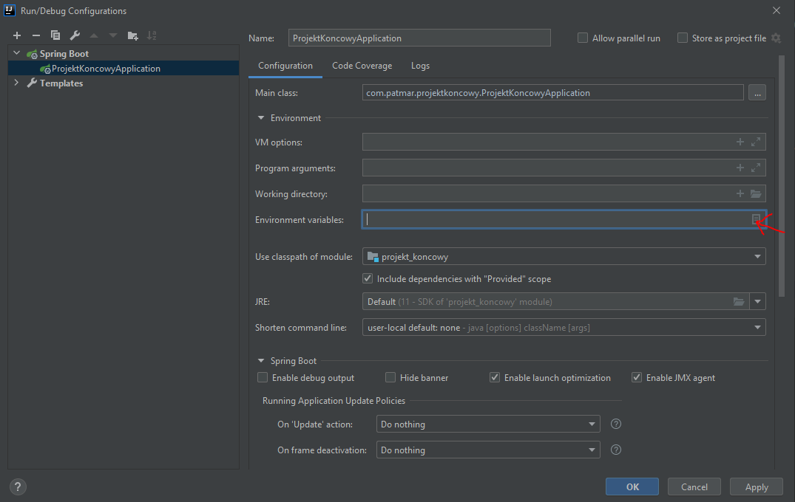
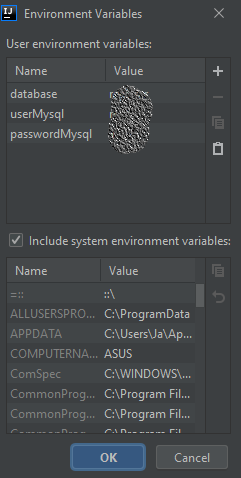

#SCHOOL DIARY
###Project description
###Configuration

In order to connect to your database you have to execute the following steps:
1. In IntelliJ go to Run->Edit Configurations...

Then click where the red arrow is.

In the 'Name' column write the same words:
- 'database' is a name of your database schema
- 'user' and 'password' are properties of your h2 database user
- 'userMysql' and 'passwordMysql' are properties of your MySQL database user

In the 'Value' column write specific data according to your database. 

After that click OK, Apply and OK.
###Functionalities